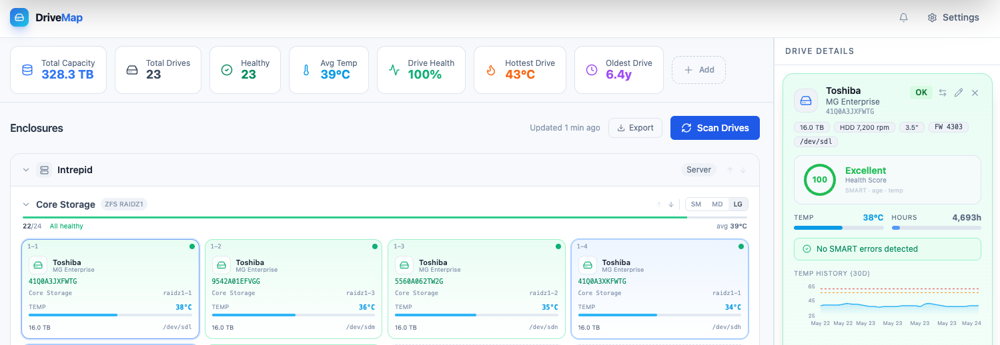
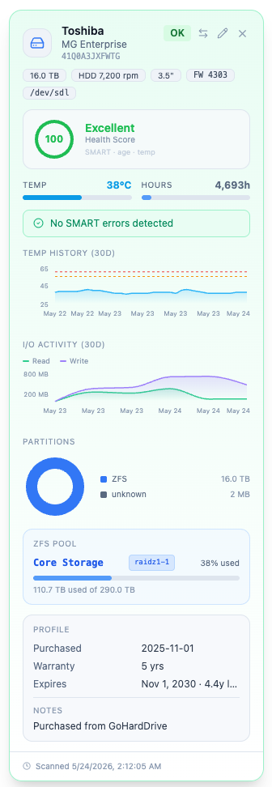
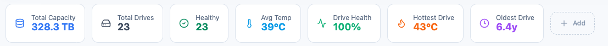
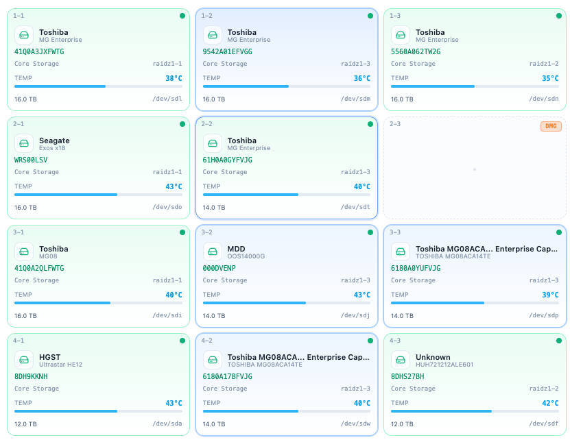
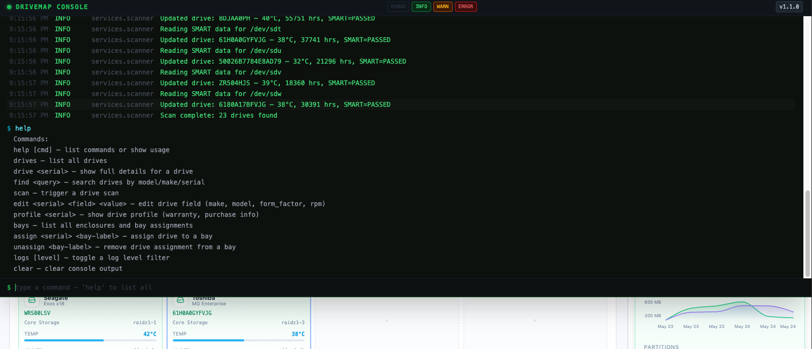
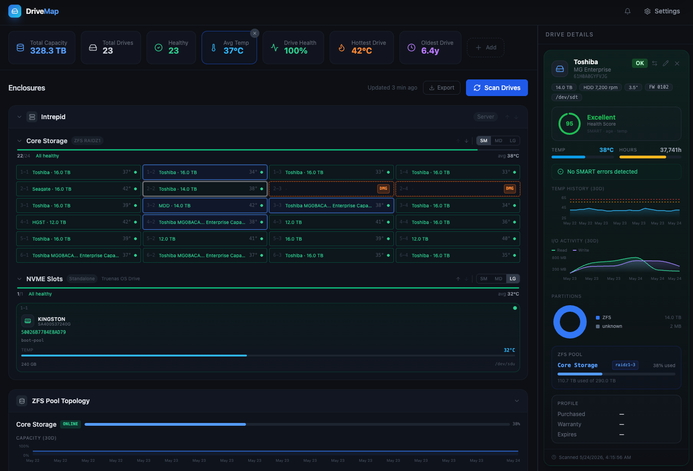
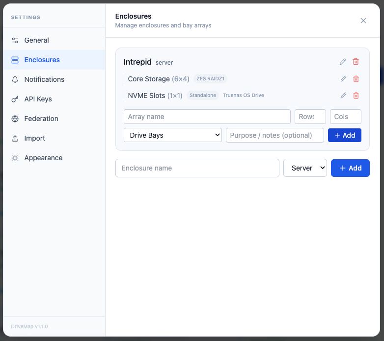
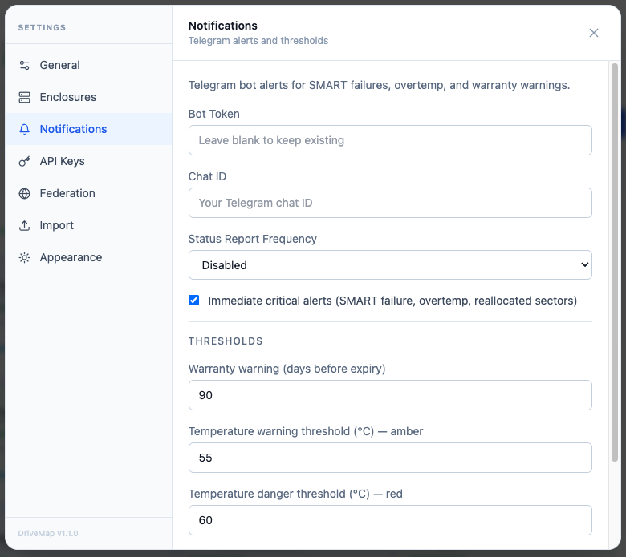
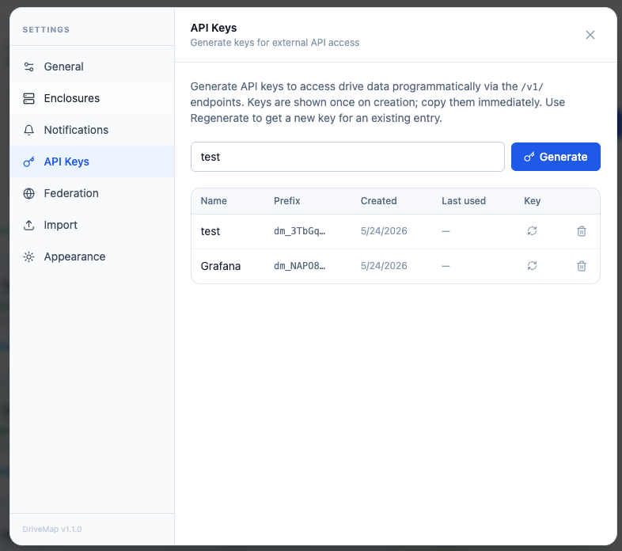
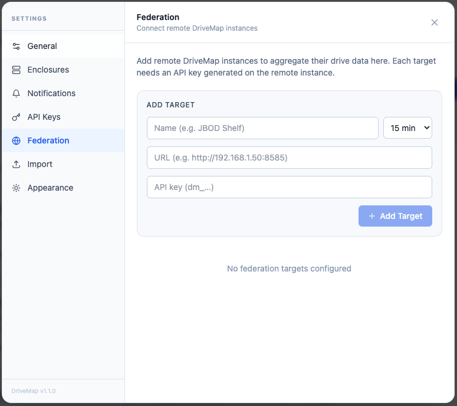

# DriveMap

A self-hosted Docker app that creates a visual bay map for your NAS or server — showing which drive is in which slot, with live SMART health, temperature, warranty tracking, ZFS pool integration, and more.

No more pulling drives to figure out which one is which.

## Features

- **Visual bay grid** — drag-and-drop drives into slots across one or more enclosures
- **SMART monitoring** — automated temperature, power-on hours, reallocated/pending sectors, and uncorrectable error collection
- **Drive health score** — composite 0–100 score with ring gauge, letter grade, and detailed deduction breakdown
- **Per-drive metadata** — make, model, serial, capacity, firmware, form factor, RPM, ZFS pool assignment
- **ZFS pool integration** — pool topology panel with vdev tree, pool capacity widgets, and per-drive pool labels
- **Customizable widget bar** — drag-to-reorder: Total Drives, Health %, Avg Temp, Hottest Drive, Total Capacity, Oldest Drive, and more
- **Terminal console** — press `` ` `` for live log streaming with level filters and a full command interface
- **Warranty tracking** — expiry alerts and warnings configurable in advance
- **Telegram notifications** — SMART failures, overtemp, warranty warnings, scheduled status reports
- **CSV bulk import** — import existing drive inventories from a spreadsheet
- **REST API** — `/v1/` endpoints with API key auth for Grafana, Home Assistant, scripts, and integrations
- **Federation** — aggregate drive data from multiple remote DriveMap instances into one dashboard
- Works on **TrueNAS Scale**, **Unraid**, or any Linux-based Docker host

---

## Screenshots

### Dashboard


### Drive Details


### Widget Bar


### ZFS Pool Topology


### Terminal Console


### Dark Mode


### Settings — Enclosures


### Settings — Notifications


### Settings — API Keys


### Settings — Federation


---

## Installing on TrueNAS Scale

DriveMap ships as a single combined container (nginx + uvicorn under supervisord), so the entire app is one image with one exposed port.

### Option A — Custom App via iX Apps UI (recommended)

This is the preferred setup for auto-updates with Watchtower or management through the TrueNAS Apps UI.

1. In the TrueNAS web UI, go to **Apps → Discover Apps → Custom App**
2. Fill in the sections as follows:

**Image Configuration**
| Field | Value |
|---|---|
| Repository | `danielgt/drivemap` |
| Tag | `latest` |
| Pull Policy | Always pull |

**Container Configuration → Ports**

| Field | Value |
|---|---|
| Host Port | `8585` (or any port you prefer) |
| Container Port | `80` |
| Protocol | TCP |

**Container Configuration → Environment Variables**

| Name | Value |
|---|---|
| `DATABASE_URL` | `sqlite:////app/data/drivemap.db` |
| `SCAN_INTERVAL_MINUTES` | `60` |

> Temperature thresholds, log level, and Telegram credentials are configured inside the app under **Settings → Notifications**.

**Container Configuration → Storage**

Host path mounts:

| Host Path | Mount Path | Read Only |
|---|---|---|
| `/dev` | `/dev` | No |
| `/run/udev` | `/run/udev` | Yes |

Persistent volume:

| Type | Mount Path |
|---|---|
| ixVolume (or host path) | `/app/data` |

> This is where the SQLite database lives — your bay map, drive profiles, and settings are all stored here. Use an ixVolume or a bind-mount to a path on your pool (e.g. `/mnt/tank/drivemap-data`).

**Security Context**

Enable **Privileged Mode** — required for `smartctl` to access block devices.

3. Click **Install**

### Option B — docker-compose

Paste [`docker-compose.truenas.yml`](docker-compose.truenas.yml) into the **Compose File** field in Custom App, or run directly with `docker compose`:

```yaml
services:
  drivemap:
    image: danielgt/drivemap:latest
    restart: unless-stopped
    volumes:
      - /dev:/dev
      - /run/udev:/run/udev:ro
      - drivemap_data:/app/data
    privileged: true
    ports:
      - "8585:80"
    environment:
      DATABASE_URL: sqlite:////app/data/drivemap.db
      SCAN_INTERVAL_MINUTES: "60"

volumes:
  drivemap_data:
```

---

## Auto-updates with Watchtower

Watchtower will automatically update DriveMap whenever a new `latest` tag is pushed to Docker Hub.

**Watchtower iX App setup:**

| Field | Value |
|---|---|
| Repository | `containrrr/watchtower` |
| Tag | `latest` |
| Pull Policy | Always pull |

Under **Volumes**, mount the Docker socket:

| Host Path | Mount Path |
|---|---|
| `/var/run/docker.sock` | `/var/run/docker.sock` |

Watchtower polls Docker Hub every 24 hours by default and restarts containers when a new image is found.

> Your data is stored in the `/app/data` volume and is never touched during an update — only the container image is replaced.

---

## Accessing the App

Once running, open:

```
http://<host-ip>:8585
```

---

## First-time Setup

1. Go to **Settings** (top-right gear icon) and open the **Enclosures** tab
2. Add an enclosure (e.g. "TrueNAS Main", type: Server)
3. Add a bay array with the correct row × column layout for your chassis
4. Click **Scan** on the Dashboard to detect all connected drives
5. Drag drives from the sidebar into the correct bay slots

---

## Installing on Other Systems

### Docker Compose (generic Linux)

```bash
git clone https://github.com/danielgt/drivemap.git
cd drivemap
cp .env.example .env
docker compose up -d
```

Then open `http://localhost:8585`.

---

## Environment Variables

| Variable | Default | Description |
|---|---|---|
| `DATABASE_URL` | `sqlite:////app/data/drivemap.db` | SQLite path inside the container |
| `SCAN_INTERVAL_MINUTES` | `60` | Background scan frequency in minutes |

Temperature thresholds, log level, Telegram credentials, and warranty warning days are all configured inside the app under **Settings → Notifications**.

---

## Console Commands

Press `` ` `` to open the terminal console. Type `help` for a full command list.

| Command | Description |
|---|---|
| `drives` | List all drives |
| `drive <serial>` | Full details for a drive |
| `find <query>` | Search by model, make, serial, or device path |
| `scan` | Trigger a drive scan |
| `edit <serial> <field> <value>` | Edit a drive field (`make`, `model`, `form_factor`, `rpm`) |
| `profile <serial>` | Show warranty and purchase info |
| `bays` | List all enclosures and bay assignments |
| `assign <serial> <bay-label>` | Assign a drive to a bay |
| `unassign <bay-label>` | Remove a bay assignment |
| `logs [level]` | Toggle log level filter |
| `clear` | Clear console output |

---

## CSV Import

Bulk-import drive inventory from a spreadsheet via **Settings → Import**.

Supported columns (all optional except **Serial**):

| Column | Description |
|---|---|
| `Serial` | Drive serial number — required, used as the unique key |
| `Position` | Bay label — assigns the drive to a matching bay if found |
| `Dev Name` | Device path, e.g. `/dev/sda` |
| `Make` | Manufacturer |
| `Model` | Drive model |
| `Size` | Capacity — accepts `4 TB`, `500 GB`, `4000 GB` |
| `Mfg Date` | Manufacturing date — accepts `YYYY-MM-DD`, `MM/DD/YYYY`, `DD/MM/YYYY` |
| `Source` | Vendor / purchase source |
| `Warranty` | Warranty period — accepts `24`, `24 months`, `2 years` |
| `Notes` | Free-text notes |

Download a pre-formatted template from **Settings → Import → Download Template**.

---

## Drive Health Score

Each drive displays a composite health score from 0–100, shown as a ring gauge in the drive details panel.

### How it's calculated

The score starts at **100** for any drive with a `PASSED` SMART status. Drives with a `FAILED` SMART status are immediately scored **0**. Drives with an `UNKNOWN` SMART status show no score.

Deductions are applied based on the following factors:

| Factor | Condition | Deduction |
|---|---|---|
| **SMART status** | `FAILED` | Score = 0 immediately |
| **Reallocated sectors** | > 0 | −4 per sector, max −40 |
| **Pending sectors** | > 0 | −5 per sector, max −25 |
| **Uncorrectable errors** | > 0 | −10 per error, max −35 |
| **Power-on hours** | > 50,000 h | −20 |
| **Power-on hours** | > 40,000 h | −12 |
| **Power-on hours** | > 25,000 h | −5 |
| **Temperature** | ≥ 60°C | −15 |
| **Temperature** | ≥ 55°C | −8 |
| **Temperature** | ≥ 50°C | −3 |

The final score is floored at 0. Only the highest matching power-on hours tier and the highest matching temperature tier apply — they are not additive.

### Score labels

| Score | Label |
|---|---|
| 90–100 | Excellent |
| 75–89 | Good |
| 60–74 | Fair |
| 40–59 | Poor |
| 0–39 | Critical |

**Example:** A drive with SMART `PASSED`, no sector errors, 30,000 power-on hours, and 48°C would score **95** (−5 for POH tier). The same drive at 56°C would score **87** (−5 POH −8 temp).

---

## External API

DriveMap exposes a versioned REST API at `/v1/` for external integrations — dashboards, monitoring tools, Home Assistant, scripts, and federation between instances.

### Authentication

All `/v1/` endpoints except `/v1/health` require an API key in the `Authorization` header:

```
Authorization: Bearer dm_your_key_here
```

Generate keys under **Settings → API Keys**. The full plaintext key is shown **once** at creation — copy it immediately. After leaving the tab, use the **Show** button to reveal it again within the same browser session, or **Regenerate** to issue a new key (the old key is revoked immediately).

**Rate limit:** 120 requests per minute per key prefix. Exceeding this returns `429 Too Many Requests`.

### Error Responses

All authenticated endpoints share the same error shapes:

| Status | When | Response body |
|---|---|---|
| `401 Unauthorized` | Missing or invalid API key | `{"detail": "Invalid or missing API key"}` |
| `429 Too Many Requests` | Rate limit exceeded (120 req/min per key) | `{"detail": "Rate limit exceeded"}` |
| `404 Not Found` | Requested resource doesn't exist | `{"detail": "Drive not found"}` |
| `422 Unprocessable Entity` | Invalid query parameter type or value | `{"detail": [{"loc": ["query", "days"], "msg": "Input should be less than or equal to 90", "type": "less_than_equal"}]}` |

---

### `GET /v1/health`

Unauthenticated liveness check. Use this to verify connectivity before configuring federation.

**Request**
```http
GET /v1/health HTTP/1.1
Host: 192.168.1.50:8585
```

**Response `200 OK`**
```json
{
  "status": "ok",
  "version": "1.2.0",
  "instance_name": "truenas"
}
```

---

### `GET /v1/drives`

Returns all drives. Optionally filter to a single drive by serial.

**Request**
```http
GET /v1/drives HTTP/1.1
Host: 192.168.1.50:8585
Authorization: Bearer dm_your_key_here
```

**Query parameters**

| Parameter | Type | Description |
|---|---|---|
| `serial` | string | Return only the drive with this serial number |

**Response `200 OK`** — array of drive objects

```json
[
  {
    "serial": "WD-WX41E23T1234",
    "device_path": "/dev/sda",
    "by_id_path": "/dev/disk/by-id/ata-WDC_WD80EFBX_WD-WX41E23T1234",
    "make": "Western Digital",
    "model": "WD Red Plus 8TB",
    "capacity_bytes": 8001563222016,
    "rpm": 5400,
    "form_factor": "3.5\"",
    "firmware_version": "81.00A81",
    "smart_status": "PASSED",
    "temperature_c": 36,
    "power_on_hours": 18432,
    "reallocated_sectors": 0,
    "pending_sectors": 0,
    "uncorrectable_errors": 0,
    "last_scanned": "2024-06-01T04:00:00",
    "zfs_pool": "tank",
    "vdev_name": "mirror-0"
  }
]
```

**Field notes:**
- `smart_status`: `"PASSED"`, `"FAILED"`, or `"UNKNOWN"`
- `capacity_bytes`, `temperature_c`, `power_on_hours`, `reallocated_sectors`, `pending_sectors`, `uncorrectable_errors`: `null` if not yet scanned
- `zfs_pool` / `vdev_name`: `null` if the drive is not in a ZFS pool

**Possible errors:** `401`, `429`

---

### `GET /v1/drives/{serial}`

Returns a single drive by serial number.

**Request**
```http
GET /v1/drives/WD-WX41E23T1234 HTTP/1.1
Host: 192.168.1.50:8585
Authorization: Bearer dm_your_key_here
```

**Response `200 OK`** — single drive object (same shape as one item from `GET /v1/drives`)

**Possible errors:** `401`, `404`, `429`

---

### `GET /v1/drives/{serial}/history`

Returns time-series scan history for a drive. Each record represents one completed background scan.

**Request**
```http
GET /v1/drives/WD-WX41E23T1234/history?days=7 HTTP/1.1
Host: 192.168.1.50:8585
Authorization: Bearer dm_your_key_here
```

**Query parameters**

| Parameter | Type | Default | Max | Description |
|---|---|---|---|---|
| `days` | integer | `30` | `90` | Number of days of history to return |

**Response `200 OK`** — array of history records, ordered oldest first

```json
[
  {
    "id": 482,
    "drive_serial": "WD-WX41E23T1234",
    "recorded_at": "2024-06-01T04:00:00",
    "temperature_c": 36,
    "reallocated_sectors": 0,
    "power_on_hours": 18432,
    "read_bytes": 1234567890,
    "write_bytes": 987654321,
    "used_bytes": 6442450944
  }
]
```

**Field notes:**
- `read_bytes` / `write_bytes`: cumulative bytes read/written since the drive was powered on (sourced from `/proc/diskstats`)
- `used_bytes`: space used on the drive's filesystem at scan time; `null` if not available
- All numeric fields may be `null` if the scanner could not read them for a given scan

**Possible errors:** `401`, `404`, `422`, `429`

---

### `GET /v1/bays`

Returns all bays across all enclosures and arrays. Each bay record includes `enclosure_name` and `array_name` for context.

**Request**
```http
GET /v1/bays HTTP/1.1
Host: 192.168.1.50:8585
Authorization: Bearer dm_your_key_here
```

**Query parameters**

| Parameter | Type | Description |
|---|---|---|
| `array_id` | integer | Filter to bays belonging to a specific bay array |

**Response `200 OK`** — array of bay objects

```json
[
  {
    "id": 1,
    "array_id": 1,
    "row": 1,
    "col": 1,
    "label": "1-1",
    "status": "normal",
    "drive_serial": "WD-WX41E23T1234",
    "enclosure_name": "Main Server",
    "array_name": "Drive Bays"
  }
]
```

**Field notes:**
- `drive_serial`: `null` if the bay is empty
- `label`: the bay's display label (e.g. `"1-1"`, `"A3"`); `null` if not set
- `status`: `"normal"`, `"damaged"`, `"hot_spare"`, or `"cold_spare"`

**Possible errors:** `401`, `422`, `429`

---

### `GET /v1/enclosures`

Returns all enclosures with their bay arrays. Does not include individual bay detail.

**Request**
```http
GET /v1/enclosures HTTP/1.1
Host: 192.168.1.50:8585
Authorization: Bearer dm_your_key_here
```

**Response `200 OK`** — array of enclosure objects

```json
[
  {
    "id": 1,
    "name": "Main Server",
    "type": "server",
    "description": null,
    "display_order": 0,
    "arrays": [
      {
        "id": 1,
        "enclosure_id": 1,
        "name": "Drive Bays",
        "rows": 4,
        "cols": 6,
        "display_order": 0,
        "group_type": "drive_bays",
        "purpose": null
      }
    ]
  }
]
```

**Field notes:**
- `type`: `"server"`, `"jbod"`, or `"other"`
- `group_type`: `"drive_bays"`, `"zfs_pool"`, `"zfs_mirror"`, `"zfs_raidz1"`, `"zfs_raidz2"`, `"hardware_raid"`, `"pcie_slots"`, `"standalone"`, or `"other"`

**Possible errors:** `401`, `429`

---

### `GET /v1/pools`

Returns current ZFS pool statistics. Returns an empty array on systems without ZFS or where `zpool` is not available.

**Request**
```http
GET /v1/pools HTTP/1.1
Host: 192.168.1.50:8585
Authorization: Bearer dm_your_key_here
```

**Response `200 OK`** — array of pool objects

```json
[
  {
    "name": "tank",
    "size_bytes": 16003146711040,
    "alloc_bytes": 9663676416,
    "free_bytes": 6339470295040,
    "capacity_pct": 60
  }
]
```

**Possible errors:** `401`, `429`

---

### Example: shell

```bash
# List all drives and print serial + temp
curl -s \
  -H "Authorization: Bearer dm_your_key_here" \
  http://192.168.1.50:8585/v1/drives \
  | jq '.[] | "\(.serial)  \(.temperature_c)°C  \(.smart_status)"'

# Get 7 days of history for one drive
curl -s \
  -H "Authorization: Bearer dm_your_key_here" \
  "http://192.168.1.50:8585/v1/drives/WD-WX41E23T1234/history?days=7" \
  | jq '.[].temperature_c'
```

### Example: Python

```python
import httpx

BASE = "http://192.168.1.50:8585"
HEADERS = {"Authorization": "Bearer dm_your_key_here"}

drives = httpx.get(f"{BASE}/v1/drives", headers=HEADERS).raise_for_status().json()
for d in drives:
    print(f"{d['serial']}  {d['temperature_c']}°C  {d['smart_status']}")
```

---

## Federation

Federation lets you designate one DriveMap instance as a hub that pulls live data from one or more remote DriveMap instances ("targets") and displays them in the Dashboard under **Remote Instances**.

### How it works

The hub polls each target's `/v1/` API at a configurable interval (5, 15, 30, or 60 minutes), caches the snapshot in memory, and renders the remote drives in a read-only panel below the local bay grid.

### Setup

**On each target instance:**
1. Go to **Settings → API Keys** and generate a key. Copy it — it's shown once (or use **Show** to reveal it again in the same browser session).

**On the hub instance:**
1. Go to **Settings → Federation** and click **Add Target**
2. Enter a name, the target's URL (e.g. `http://192.168.1.51:8585`), the API key from step 1, and a sync interval
3. Click **Add Target** — the hub will begin polling on the next scheduler tick

The **Remote Instances** panel appears in the Dashboard automatically once at least one target has synced successfully. Each remote instance shows a compact drive list with SMART status, temperature, and ZFS pool assignments. Click **Sync Now** in Settings → Federation to trigger an immediate poll.

### Notes

- Targets must be running DriveMap v1.0.0 or later.
- Federation target API keys are stored in plaintext in the local SQLite database — the same threat model as the Telegram bot token. This is appropriate for LAN-only deployments on a trusted host.
- If a sync fails, the last error is shown in the Federation tab. The hub continues serving the last successful snapshot until the next successful poll.
- Before exposing any DriveMap instance to the internet, restrict CORS origins and place the app behind a reverse proxy with TLS and authentication.

---

## Requirements

- Docker & Docker Compose
- Linux host (bare metal or VM) — required for `/dev` access and SMART data
- Privileged container mode (required for `smartctl`)

---

## Changelog

See [project/changelog.md](project/changelog.md).

## Project Docs

- [Data model, tech stack, decisions](project/info.md)
- [File structure](project/structure.md)
- [Version history](project/changelog.md)
